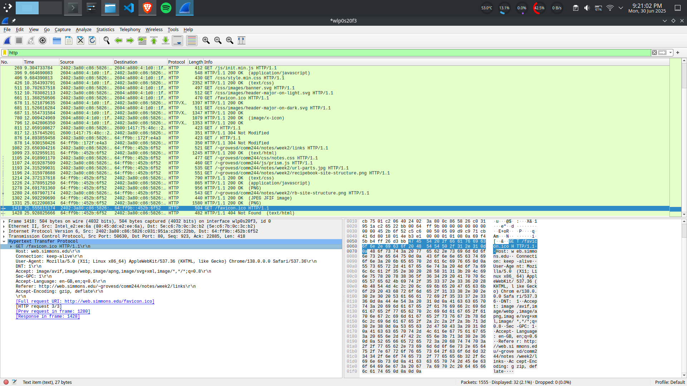

Elevate-Labs-Internship-D05  

Task 5 : Capture and Analyze Network Traffic Using Wireshark.  

Objective: Capture live network packets and identify basic protocols and traffic types.  
Tools: Wireshark (free).  
Deliverables: A packet capture (.pcap) file and a short report of protocols identified.  

Step 1: Install Wireshark  
Install using the official website or use following command (for linux):
```sudo apt install wireshark```

Step 2: Start Wireshark and Select Interface  
- Open Wireshark.
- Choose your active network interface (e.g., eth0, wlan0, or Wi-Fi).
- Click Start capturing packets (blue shark fin icon


Step 3: Generate Traffic
- Visit a website: https://www.example.com
- Use ping command:
  ```ping www.youtube.com```


Step 4: Stop the Capture After 1 Minute  

Step 5: Filter by Protocol

Use filters in Wireshark’s filter bar:  
- http → to view HTTP packets
- dns → to view DNS lookups
- tcp or udp → to view transport layer packets



Step 6: Export as .pcap File
- Go to File → Save As
- Save the capture as network_traffic_analysis.pcap

